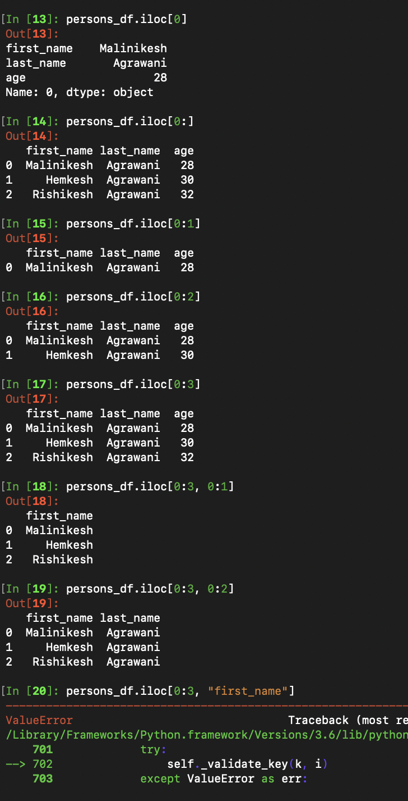

# propreps

A repository to enhance the existing skills set by solving different kinds of coding problems, challenges etc. 

---

### Length of longest substring without repeating characters

___

### Find pairs

---

### Balanced parantheses (Symmetric case only)

---

---

---

### Random examples

# pandas

