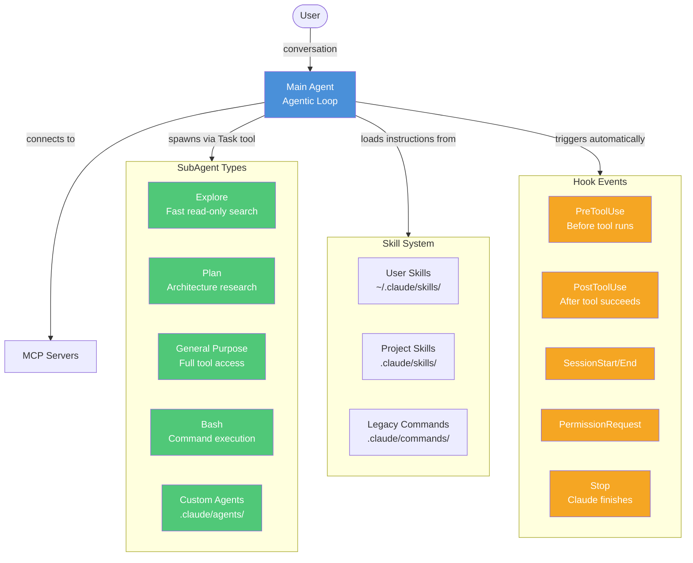
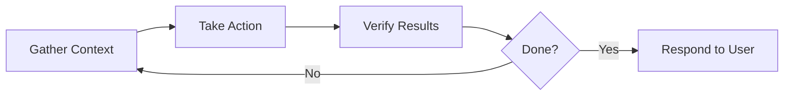
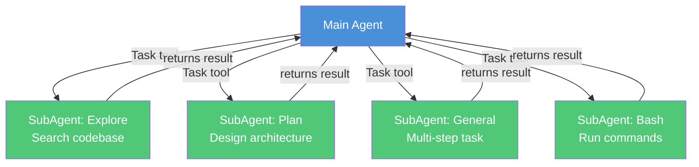
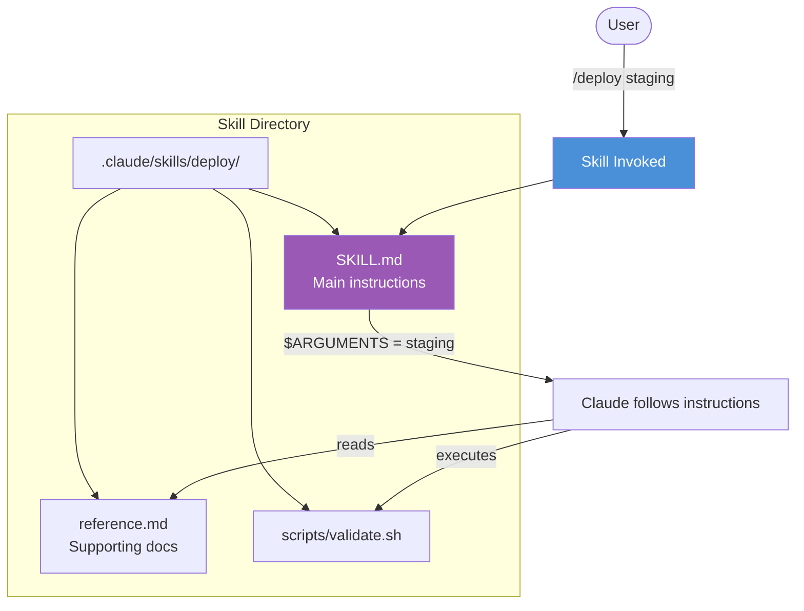
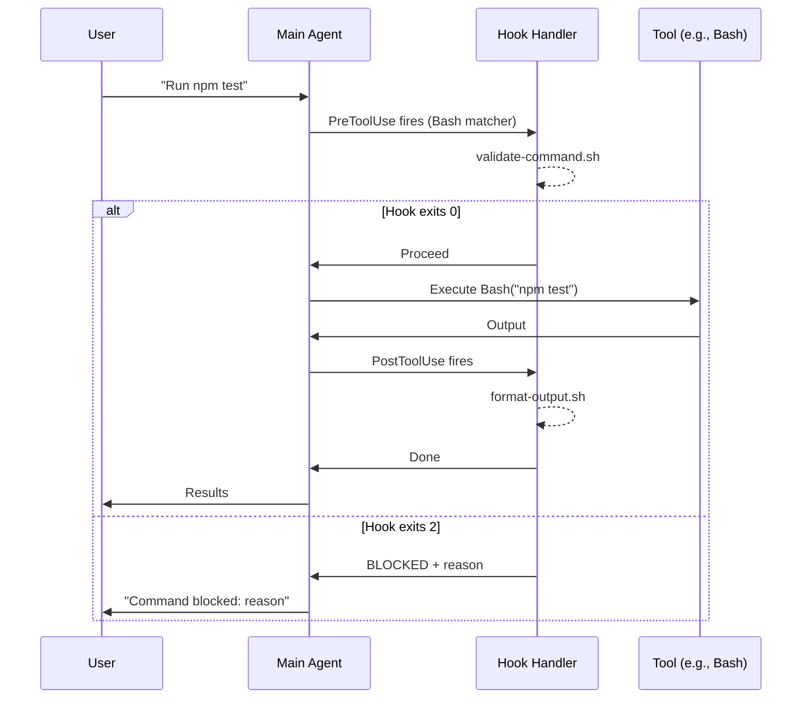
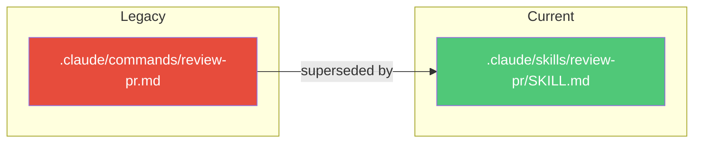
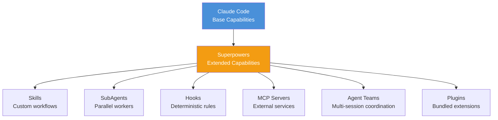
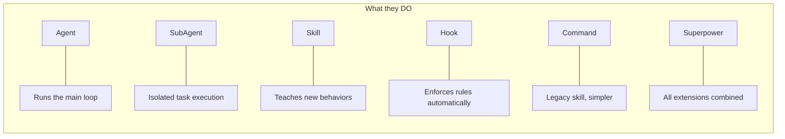
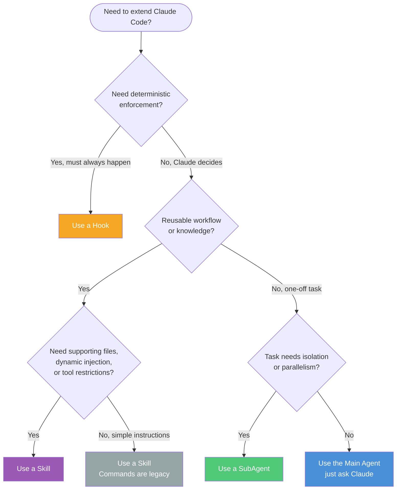

# Agents vs SubAgents vs Skills vs Hooks vs Commands vs Superpowers in Claude Code

> A step-by-step breakdown of the six core extensibility concepts in Claude Code, how they differ, and when to use each.

## Key Points

- **Agent** = the main Claude Code session running the agentic loop (gather context -> act -> verify -> repeat)
- **SubAgent** = an isolated worker spawned by the main agent via the Task tool, with its own context window
- **Skill** = a reusable `SKILL.md` file that teaches Claude new behaviors or workflows (invoked via `/skill-name`)
- **Hook** = a deterministic shell command or prompt that fires automatically at lifecycle events (enforce rules, not suggest)
- **Command** = the legacy precursor to Skills (`.claude/commands/*.md`) -- still works but superseded
- **Superpowers** = informal/community term for all the extensions combined (not an official concept)

---

## Architecture Overview



---

## Step-by-Step: Each Concept in Detail

---

### 1. Agent (The Main Session)

The **Agent** is Claude Code itself -- the main conversational session that runs the **agentic loop**.



**What it does:**
- Reads files, searches code, understands your project
- Edits files, runs commands, creates content
- Checks its work (runs tests, reads output)
- Repeats until the task is complete

**Powered by:**
- Model (Opus / Sonnet / Haiku)
- Tools (Read, Write, Edit, Bash, Glob, Grep, WebSearch, etc.)
- Context (CLAUDE.md, skills, conversation history)

**Configuration:**
- Model: `/model` or `claude --model <name>`
- Permissions: `Shift+Tab` or `.claude/settings.json`
- Project context: `CLAUDE.md` at project root
- Extra dirs: `--add-dir <path>`

---

### 2. SubAgents (Isolated Workers)

SubAgents are **specialized, isolated AI assistants** spawned by the main agent to handle specific tasks without consuming the main conversation's context window.



**Built-in SubAgent types:**

| Type | Model | Tools | Use Case |
|------|-------|-------|----------|
| **Explore** | Haiku | Read-only (Glob, Grep, Read) | Fast codebase search & analysis |
| **Plan** | Inherited | Read-only | Research for implementation planning |
| **General-purpose** | Inherited | All tools | Complex multi-step tasks |
| **Bash** | Inherited | Bash only | Command execution in separate context |

**How they're spawned:**
```
Main agent decides: "This task needs isolated research"
  -> Calls Task tool with subagent_type="Explore"
  -> SubAgent runs in its own context window
  -> SubAgent returns a single result message
  -> Main agent continues with the result
```

**Custom SubAgents** -- define your own in `.claude/agents/<name>.md`:
```yaml
---
name: code-reviewer
description: Reviews code for quality and best practices
tools: Read, Grep, Glob
model: sonnet
---

You are a code reviewer. Analyze code for...
```

**Key properties:**
- Separate context window (doesn't pollute main conversation)
- Can run in foreground (blocking) or background (parallel)
- Can be resumed with their agent ID
- Can run in isolated git worktrees

---

### 3. Skills (Teachable Workflows)

Skills are **reusable instruction sets** packaged as `SKILL.md` files that teach Claude new behaviors.



**File structure:**
```
.claude/skills/<skill-name>/
  SKILL.md          # Required - main instructions
  reference.md      # Optional - supporting docs
  examples/         # Optional - example outputs
  scripts/          # Optional - executable scripts
```

**SKILL.md anatomy:**
```yaml
---
name: deploy                          # Slash command name
description: Deploy the app           # Claude uses this to decide when to auto-load
disable-model-invocation: false       # Can Claude auto-invoke?
user-invocable: true                  # Can user invoke via /deploy?
argument-hint: [environment]          # Shown in autocomplete
allowed-tools: Read, Bash             # Tools allowed without permission prompts
model: sonnet                         # Override model
context: fork                         # Run in isolated subagent
agent: Explore                        # Which subagent type
---

Deploy to $0 environment following these steps:
1. Run tests
2. Build
3. Push
```

**Locations & scope:**

| Location | Scope |
|----------|-------|
| `~/.claude/skills/<name>/SKILL.md` | Personal (all projects) |
| `.claude/skills/<name>/SKILL.md` | Project only |
| Plugin `skills/` directory | Where plugin enabled |
| Enterprise managed settings | Organization-wide |

**String substitutions:**
- `$ARGUMENTS` -- all arguments passed
- `$0`, `$1`, `$2` -- positional arguments
- `` !`command` `` -- inject shell command output inline

**Invocation control:**

| Setting | User invokes | Claude invokes |
|---------|-------------|----------------|
| Default | Yes | Yes |
| `disable-model-invocation: true` | Yes | No |
| `user-invocable: false` | No | Yes |

---

### 4. Hooks (Deterministic Automation)

Hooks are **shell commands or prompts that fire automatically** at specific lifecycle events. Unlike skills (which *teach*), hooks *enforce*.



**Hook events:**

| Event | When it fires | Can block? |
|-------|--------------|------------|
| `SessionStart` | Session begins/resumes | No |
| `UserPromptSubmit` | User sends a message | Yes |
| `PreToolUse` | Before a tool runs | Yes |
| `PostToolUse` | After a tool succeeds | No |
| `PostToolUseFailure` | After a tool fails | No |
| `PermissionRequest` | Permission dialog shown | Yes |
| `Stop` | Claude finishes responding | Yes |
| `SubagentStart` | SubAgent spawns | No |
| `SubagentStop` | SubAgent finishes | Yes |
| `SessionEnd` | Session terminates | No |
| `Notification` | Claude sends notification | No |
| `PreCompact` | Before context compaction | No |

**Configuration** (in `.claude/settings.json`):
```json
{
  "hooks": {
    "PreToolUse": [
      {
        "matcher": "Bash",
        "hooks": [
          {
            "type": "command",
            "command": "./scripts/validate-command.sh",
            "timeout": 600
          }
        ]
      }
    ],
    "PostToolUse": [
      {
        "matcher": "Edit|Write",
        "hooks": [
          {
            "type": "command",
            "command": "prettier --write"
          }
        ]
      }
    ]
  }
}
```

**Hook handler types:**

| Type | What it does |
|------|-------------|
| `command` | Runs a shell command, receives JSON on stdin |
| `prompt` | Sends a prompt to an LLM for evaluation |
| `agent` | Spawns an agent to handle the check |

**Exit codes:**
- `0` = proceed (or return structured JSON)
- `2` = **block the action** (stderr message shown to Claude)
- Other = non-blocking error (logged)

**Common patterns:**
- Format code after edits (PostToolUse + Edit -> prettier)
- Block destructive commands (PreToolUse + Bash -> validate)
- Auto-run tests after changes (PostToolUse + Write -> jest)
- Notify on completion (Stop -> notify-send)

---

### 5. Commands (Legacy System)

Commands are the **older, simpler precursor to Skills**. They still work but Skills are recommended for new development.



**Commands file:** `.claude/commands/review-pr.md`
```yaml
---
name: review-pr
description: Review a pull request
---

Review PR #$ARGUMENTS focusing on code quality...
```

**Skills vs Commands:**

| Feature | Commands | Skills |
|---------|----------|--------|
| Location | `.claude/commands/` | `.claude/skills/<name>/` |
| Supporting files | No | Yes (templates, scripts, docs) |
| Dynamic injection (`` !`cmd` ``) | No | Yes |
| SubAgent execution (`context: fork`) | No | Yes |
| Lifecycle hooks | No | Yes |
| Tool restrictions (`allowed-tools`) | No | Yes |
| Model override | No | Yes |
| Invocation control | Basic | Full (disable-model, user-invocable) |

**Migration:** Simply move your `.md` file into `.claude/skills/<name>/SKILL.md` and optionally add frontmatter fields.

---

### 6. Superpowers (Informal Term)

**"Superpowers" is not an official Claude Code concept.** It's a community/casual term referring to the combined capabilities you unlock by using all the extension points together.



**What people mean by "superpowers":**
- Connecting MCP servers (databases, APIs, Slack, GitHub)
- Creating custom skills for domain-specific workflows
- Setting up hooks for automated code formatting, testing, validation
- Configuring subagents for parallel research
- Using plugins to bundle & share extensions with teams

**Official terminology:** Anthropic's docs use "Extend Claude Code" rather than "superpowers."

---

## Comparison Table



| Aspect | Agent | SubAgent | Skill | Hook | Command |
|--------|-------|----------|-------|------|---------|
| **What** | Main session | Isolated worker | Instruction set | Auto-trigger | Legacy instruction |
| **Who creates** | Built-in | Built-in + custom | You | You | You |
| **Invoked by** | User (conversation) | Main agent (Task tool) | User (`/`) or Claude | System (events) | User (`/`) or Claude |
| **Context** | Full conversation | Own isolated context | Loaded into main | Runs externally | Loaded into main |
| **Can edit files** | Yes | Configurable | Via Claude, yes | Via shell, yes | Via Claude, yes |
| **Deterministic** | No (LLM) | No (LLM) | No (LLM) | **Yes** (shell) | No (LLM) |
| **Config location** | CLI flags, settings | `.claude/agents/` | `.claude/skills/` | `.claude/settings.json` | `.claude/commands/` |

---

## Decision Flowchart: Which One to Use?



---

## Quick Reference: File Locations

```
~/.claude/
  settings.json              # User-level hooks, permissions
  skills/<name>/SKILL.md     # Personal skills (all projects)
  agents/<name>.md           # Personal subagent definitions

<project>/
  CLAUDE.md                  # Project context & instructions
  .claude/
    settings.json            # Project hooks, permissions
    skills/<name>/SKILL.md   # Project skills
    agents/<name>.md         # Project subagent definitions
    commands/<name>.md       # Legacy commands (still work)
```

## Summary

| Concept | One-liner | When to reach for it |
|---------|-----------|---------------------|
| **Agent** | The main Claude Code session | Always -- it's the foundation |
| **SubAgent** | Isolated worker with own context | Parallel tasks, context-heavy research, enforced read-only |
| **Skill** | Teachable workflow as SKILL.md | Custom `/commands`, domain knowledge, repeatable processes |
| **Hook** | Auto-trigger on lifecycle events | Code formatting, blocking dangerous commands, test automation |
| **Command** | Legacy skill (simpler) | Migrate to Skills; only keep if already working |
| **Superpowers** | All extensions combined | Not a real feature -- just use the above together |

---

*Notes created: 2026-02-23*
