# Agents vs SubAgents vs Tools vs Skills vs Hooks vs Commands vs Superpowers in Claude Code

> A step-by-step breakdown of the seven core concepts in Claude Code -- what they are, how they connect, and when to use each, with practical examples.

## Key Points

- **Agent** = the main Claude Code session running the agentic loop (gather context -> act -> verify -> repeat)
- **SubAgent** = an isolated worker spawned by the main agent via the Task tool, with its own context window
- **Tool** = an atomic capability the agent invokes to interact with the world (Read, Bash, Edit, Grep, etc.)
- **Skill** = a reusable `SKILL.md` file that teaches Claude new behaviors or workflows (invoked via `/skill-name`)
- **Hook** = a deterministic shell command or prompt that fires automatically at lifecycle events (enforce rules, not suggest)
- **Command** = the legacy precursor to Skills (`.claude/commands/*.md`) -- still works but superseded
- **Superpowers** = informal/community term for all the extensions combined (not an official concept)

---

## Architecture Overview

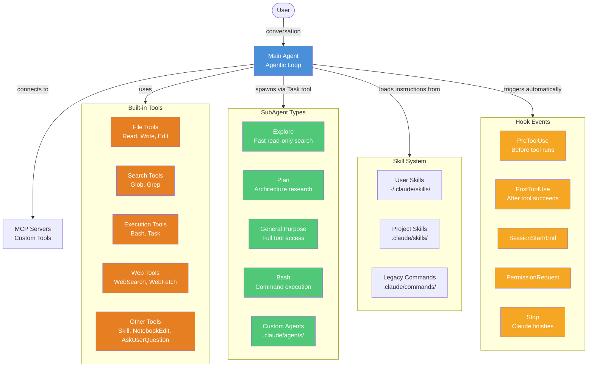

---

## Step-by-Step: Each Concept in Detail

---

### 1. Agent (The Main Session)

The **Agent** is Claude Code itself -- the main conversational session that runs the **agentic loop**.

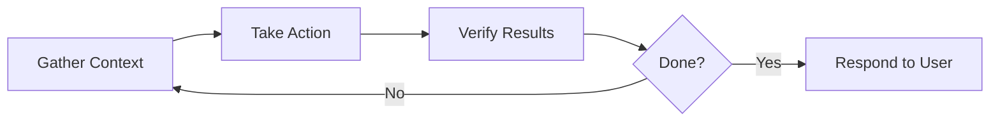

**What it does:**
- Reads files, searches code, understands your project
- Edits files, runs commands, creates content
- Checks its work (runs tests, reads output)
- Repeats until the task is complete

**Powered by:**
- Model (Opus / Sonnet / Haiku)
- Tools (Read, Write, Edit, Bash, Glob, Grep, WebSearch, etc.)
- Context (CLAUDE.md, skills, conversation history)

**Configuration:**
- Model: `/model` or `claude --model <name>`
- Permissions: `Shift+Tab` or `.claude/settings.json`
- Project context: `CLAUDE.md` at project root
- Extra dirs: `--add-dir <path>`

#### Example: What happens when you say "fix the bug in auth.py"

```
You: "fix the bug in auth.py"

Agent thinks: I need to understand the bug first
  1. [Glob tool]   -> finds src/auth.py
  2. [Read tool]   -> reads the file contents
  3. [Grep tool]   -> searches for related tests
  4. [Read tool]   -> reads test file to understand expected behavior
  5. [Edit tool]   -> fixes the bug in auth.py
  6. [Bash tool]   -> runs "pytest tests/test_auth.py" to verify
  7. Responds: "Fixed the null check on line 42. Tests pass."
```

The agent orchestrates all of this automatically -- choosing which tools to use, in what order, and verifying results.

---

### 2. SubAgents (Isolated Workers)

SubAgents are **specialized, isolated AI assistants** spawned by the main agent to handle specific tasks without consuming the main conversation's context window.

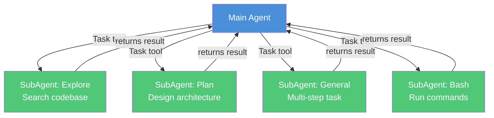

**Built-in SubAgent types:**

| Type | Model | Tools | Use Case |
|------|-------|-------|----------|
| **Explore** | Haiku | Read-only (Glob, Grep, Read) | Fast codebase search & analysis |
| **Plan** | Inherited | Read-only | Research for implementation planning |
| **General-purpose** | Inherited | All tools | Complex multi-step tasks |
| **Bash** | Inherited | Bash only | Command execution in separate context |

**How they're spawned:**
```
Main agent decides: "This task needs isolated research"
  -> Calls Task tool with subagent_type="Explore"
  -> SubAgent runs in its own context window
  -> SubAgent returns a single result message
  -> Main agent continues with the result
```

**Custom SubAgents** -- define your own in `.claude/agents/<name>.md`:
```yaml
---
name: code-reviewer
description: Reviews code for quality and best practices
tools: Read, Grep, Glob
model: sonnet
---

You are a code reviewer. Analyze code for...
```

**Key properties:**
- Separate context window (doesn't pollute main conversation)
- Can run in foreground (blocking) or background (parallel)
- Can be resumed with their agent ID
- Can run in isolated git worktrees

#### Example: SubAgent doing parallel research

```
You: "Compare our auth implementation with best practices"

Main Agent thinks: This needs deep research. I'll use subagents in parallel.

  [Task tool] -> SubAgent 1 (Explore): "Find all auth-related files"
  [Task tool] -> SubAgent 2 (Explore): "Search for security patterns"
    (both run simultaneously, each in their own context)

  SubAgent 1 returns: "Found src/auth.py, src/middleware/jwt.py, src/models/user.py"
  SubAgent 2 returns: "Found OWASP patterns: password hashing, token rotation..."

Main Agent: Combines both results, writes a coherent comparison.
```

#### Example: Custom SubAgent definition

File: `.claude/agents/test-runner.md`
```yaml
---
name: test-runner
description: Runs tests and reports results. Use after code changes.
tools: Bash, Read, Glob
model: haiku
---

You are a test runner. When given a task:
1. Find relevant test files using Glob
2. Run them with pytest (or the project's test framework)
3. Report: passed/failed count, failure details, and suggestions
```

Now when the main agent edits code, it can spawn this subagent:
```
Main Agent: [Edit tool] fixes a bug in auth.py
Main Agent: [Task tool] -> test-runner subagent: "Run auth tests"
  test-runner: [Glob] finds tests/test_auth.py
  test-runner: [Bash] runs pytest tests/test_auth.py
  test-runner: returns "8 passed, 0 failed"
Main Agent: "Bug fixed and all tests pass."
```

---

### 3. Tools (The Agent's Hands)

Tools are the **atomic capabilities** that the agent uses to interact with the codebase and environment. Without tools, Claude can only produce text. With tools, it can act.

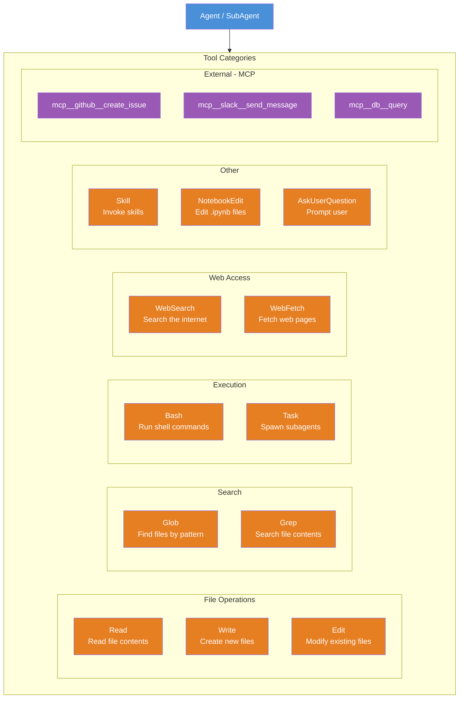

#### All Built-in Tools

| Tool | Category | What It Does | Example |
|------|----------|-------------|---------|
| **Read** | File | Read file contents | Read `src/auth.py` -> returns file content |
| **Write** | File | Create a new file | Write `src/utils/helpers.py` with content |
| **Edit** | File | Modify existing file | Replace `old_string` with `new_string` in a file |
| **Glob** | Search | Find files by pattern | `**/*.py` -> finds all Python files |
| **Grep** | Search | Search contents with regex | `def authenticate` -> finds all matching lines |
| **Bash** | Execution | Run shell commands | `npm test`, `git status`, `docker build .` |
| **Task** | Execution | Spawn a subagent | Launch an Explore subagent to research code |
| **WebSearch** | Web | Search the internet | Search for "Python asyncio best practices" |
| **WebFetch** | Web | Fetch & parse a URL | Fetch docs from a URL and extract info |
| **Skill** | Other | Invoke a skill | Trigger `/deploy staging` |
| **NotebookEdit** | Other | Edit Jupyter notebooks | Replace a cell's content in a `.ipynb` file |
| **AskUserQuestion** | Other | Ask the user a question | "Which database should I use?" with options |

#### Tool Permission System

Tools use a tiered permission model -- some are always safe, some always need approval.

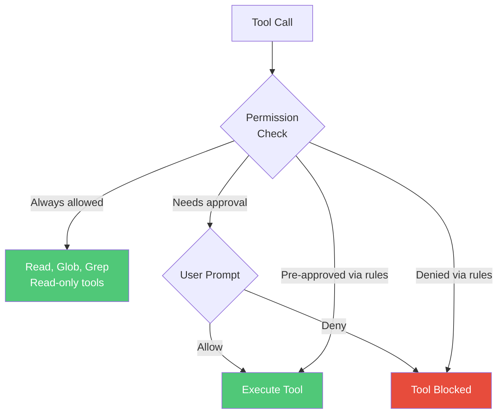

**Permission tiers:**

| Tier | Tools | Default Behavior |
|------|-------|-----------------|
| **Always allowed** | Read, Glob, Grep | No prompt needed |
| **Needs approval** | Bash, Edit, Write, WebFetch | Prompts user first |
| **Pre-approved** | Anything in `allow` rules | Auto-approved |
| **Denied** | Anything in `deny` rules | Auto-blocked |

#### Example: Permission rules in `.claude/settings.json`

```json
{
  "permissions": {
    "allow": [
      "Bash(npm run test)",
      "Bash(npm run build)",
      "Bash(git status)",
      "Bash(git diff *)",
      "Edit(src/**)"
    ],
    "deny": [
      "Bash(rm -rf *)",
      "Bash(git push --force *)",
      "Read(.env*)"
    ]
  }
}
```

What this does:
- `npm run test`, `npm run build`, `git status`, `git diff` -- run without asking
- Editing files in `src/` -- allowed without asking
- `rm -rf` and force-push -- always blocked, never even prompted
- `.env` files -- can't be read (protects secrets)

**Rule evaluation order:** deny (first) -> ask -> allow (last). First match wins.

#### Example: Permission rule syntax by tool

```json
{
  "permissions": {
    "allow": [
      "Bash(npm run *)",                    "// Wildcard: any npm run command",
      "Bash(git commit *)",                 "// Allow git commits",
      "Read(docs/**)",                      "// Read anything under docs/",
      "Edit(src/**/*.py)",                  "// Edit Python files in src/",
      "WebFetch(domain:docs.python.org)",   "// Fetch from Python docs only",
      "mcp__github__*",                     "// All GitHub MCP tools",
      "Task(Explore)"                       "// Allow Explore subagent"
    ]
  }
}
```

> Note: The `"// comment"` entries above are for illustration only -- JSON doesn't support comments. In real config, omit them.

#### How Tools Connect to Everything Else

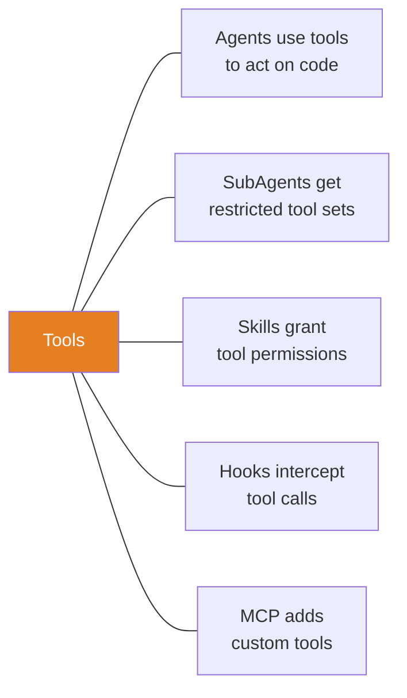

| Concept | Relationship to Tools |
|---------|----------------------|
| **Agent** | The agent *uses* tools. Tools are the agent's hands. |
| **SubAgent** | Each subagent gets a *restricted subset* of tools (e.g., Explore = read-only). |
| **Skill** | Skills can *grant* tool permissions via `allowed-tools` in frontmatter. |
| **Hook** | Hooks *intercept* tool calls at PreToolUse/PostToolUse lifecycle events. |
| **MCP** | MCP servers *add new tools* (e.g., `mcp__github__create_issue`). |
| **Permissions** | The settings.json `allow`/`deny` rules *control* which tools can run. |

#### Example: Adding custom tools via MCP

```bash
# Add a GitHub MCP server (gives tools like create_issue, search_repos, etc.)
claude mcp add --transport http github https://api.githubcopilot.com/mcp/

# Add a database tool
claude mcp add --transport stdio db -- npx @bytebase/dbhub --dsn "postgresql://localhost/mydb"

# Add a Slack tool
claude mcp add --transport http slack https://mcp.slack.com
```

After adding, Claude can use them like:
```
Agent: [mcp__github__create_issue] -> creates "Fix auth bug" issue
Agent: [mcp__db__query] -> runs "SELECT * FROM users WHERE active = true"
Agent: [mcp__slack__send_message] -> sends "Deploy complete!" to #releases
```

MCP tools show up as `mcp__<servername>__<toolname>` and can be controlled with the same permission rules:
```json
{
  "permissions": {
    "allow": ["mcp__github__*"],
    "deny": ["mcp__db__execute_write"]
  }
}
```

---

### 4. Skills (Teachable Workflows)

Skills are **reusable instruction sets** packaged as `SKILL.md` files that teach Claude new behaviors.

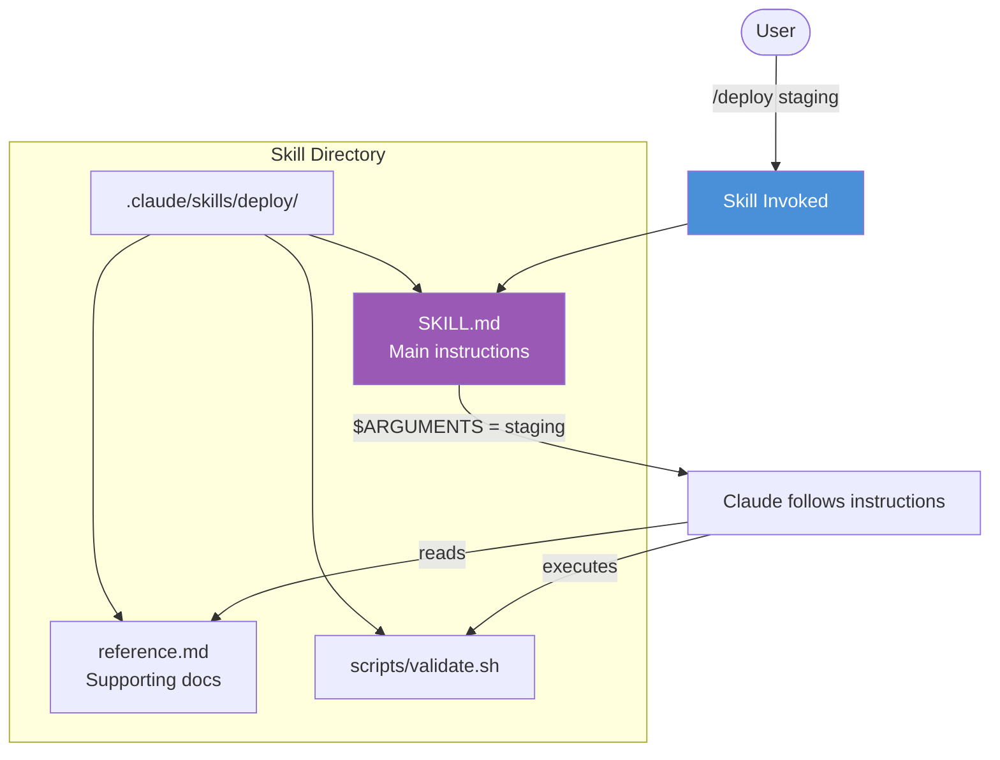

**File structure:**
```
.claude/skills/<skill-name>/
  SKILL.md          # Required - main instructions
  reference.md      # Optional - supporting docs
  examples/         # Optional - example outputs
  scripts/          # Optional - executable scripts
```

**SKILL.md anatomy:**
```yaml
---
name: deploy                          # Slash command name
description: Deploy the app           # Claude uses this to decide when to auto-load
disable-model-invocation: false       # Can Claude auto-invoke?
user-invocable: true                  # Can user invoke via /deploy?
argument-hint: [environment]          # Shown in autocomplete
allowed-tools: Read, Bash             # Tools allowed without permission prompts
model: sonnet                         # Override model
context: fork                         # Run in isolated subagent
agent: Explore                        # Which subagent type
---

Deploy to $0 environment following these steps:
1. Run tests
2. Build
3. Push
```

**Locations & scope:**

| Location | Scope |
|----------|-------|
| `~/.claude/skills/<name>/SKILL.md` | Personal (all projects) |
| `.claude/skills/<name>/SKILL.md` | Project only |
| Plugin `skills/` directory | Where plugin enabled |
| Enterprise managed settings | Organization-wide |

**String substitutions:**
- `$ARGUMENTS` -- all arguments passed
- `$0`, `$1`, `$2` -- positional arguments
- `` !`command` `` -- inject shell command output inline

**Invocation control:**

| Setting | User invokes | Claude invokes |
|---------|-------------|----------------|
| Default | Yes | Yes |
| `disable-model-invocation: true` | Yes | No |
| `user-invocable: false` | No | Yes |

#### Example: A complete skill for generating API endpoints

File: `.claude/skills/api-endpoint/SKILL.md`
```yaml
---
name: api-endpoint
description: Generate a new REST API endpoint with tests
argument-hint: <resource-name>
allowed-tools: Read, Write, Edit, Bash, Glob
---

Generate a new REST API endpoint for the resource: $0

Steps:
1. Read the existing route structure in src/routes/
2. Create a new route file: src/routes/$0.py
3. Add CRUD operations (GET, POST, PUT, DELETE)
4. Create test file: tests/test_$0.py
5. Register the route in src/app.py
6. Run tests to verify
```

Usage:
```
/api-endpoint users     -> creates src/routes/users.py + tests
/api-endpoint products  -> creates src/routes/products.py + tests
```

#### Example: Skill with dynamic shell injection

File: `.claude/skills/pr-summary/SKILL.md`
```yaml
---
name: pr-summary
description: Summarize the current PR
context: fork
allowed-tools: Bash
---

Here is the current PR diff:
!`gh pr diff`

Here are the PR comments:
!`gh pr view --comments`

Summarize this PR in 3-5 bullet points. Note any concerns.
```

The `` !`command` `` syntax runs those commands first, injecting their output before Claude even sees the skill.

---

### 5. Hooks (Deterministic Automation)

Hooks are **shell commands or prompts that fire automatically** at specific lifecycle events. Unlike skills (which *teach*), hooks *enforce*.

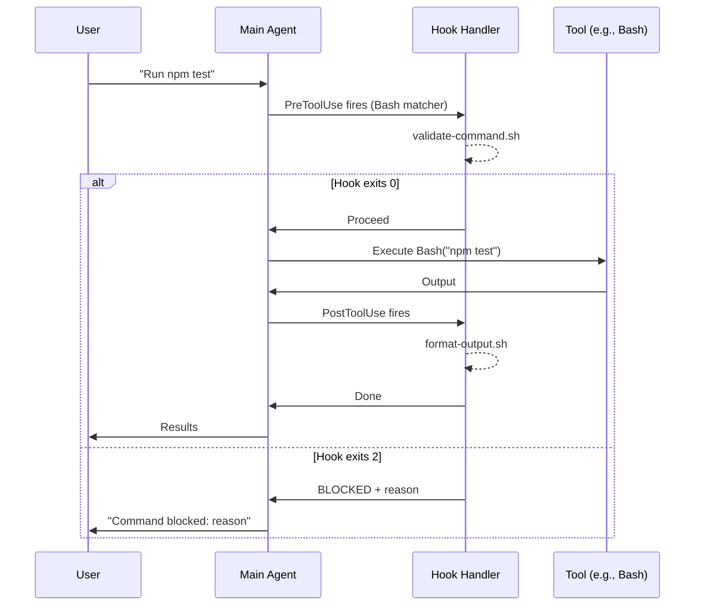

**Hook events:**

| Event | When it fires | Can block? |
|-------|--------------|------------|
| `SessionStart` | Session begins/resumes | No |
| `UserPromptSubmit` | User sends a message | Yes |
| `PreToolUse` | Before a tool runs | Yes |
| `PostToolUse` | After a tool succeeds | No |
| `PostToolUseFailure` | After a tool fails | No |
| `PermissionRequest` | Permission dialog shown | Yes |
| `Stop` | Claude finishes responding | Yes |
| `SubagentStart` | SubAgent spawns | No |
| `SubagentStop` | SubAgent finishes | Yes |
| `SessionEnd` | Session terminates | No |
| `Notification` | Claude sends notification | No |
| `PreCompact` | Before context compaction | No |

**Hook handler types:**

| Type | What it does |
|------|-------------|
| `command` | Runs a shell command, receives JSON on stdin |
| `prompt` | Sends a prompt to an LLM for evaluation |
| `agent` | Spawns an agent to handle the check |

**Exit codes:**
- `0` = proceed (or return structured JSON)
- `2` = **block the action** (stderr message shown to Claude)
- Other = non-blocking error (logged)

#### Example: Auto-format code after every edit

`.claude/settings.json`:
```json
{
  "hooks": {
    "PostToolUse": [
      {
        "matcher": "Edit|Write",
        "hooks": [
          {
            "type": "command",
            "command": "prettier --write \"$TOOL_INPUT_FILE_PATH\""
          }
        ]
      }
    ]
  }
}
```

Every time Claude uses Edit or Write, prettier auto-formats the file.

#### Example: Block dangerous shell commands

`scripts/validate-bash.sh`:
```bash
#!/bin/bash
INPUT=$(cat)  # Read JSON from stdin
COMMAND=$(echo "$INPUT" | jq -r '.tool_input.command')

# Block destructive patterns
if echo "$COMMAND" | grep -qE '(rm -rf|drop table|truncate|--force)'; then
  echo "BLOCKED: Destructive command detected: $COMMAND" >&2
  exit 2  # Exit code 2 = block the tool call
fi

exit 0  # Exit code 0 = allow the tool call
```

`.claude/settings.json`:
```json
{
  "hooks": {
    "PreToolUse": [
      {
        "matcher": "Bash",
        "hooks": [
          {
            "type": "command",
            "command": "./scripts/validate-bash.sh"
          }
        ]
      }
    ]
  }
}
```

Now if Claude tries to run `rm -rf /`, the hook blocks it before it ever executes.

#### Example: Auto-run tests after file changes

```json
{
  "hooks": {
    "PostToolUse": [
      {
        "matcher": "Edit|Write",
        "hooks": [
          {
            "type": "command",
            "command": "npm test --silent 2>&1 | tail -5"
          }
        ]
      }
    ]
  }
}
```

#### Hook input JSON (what hooks receive on stdin)

When a PreToolUse hook fires for a Bash command:
```json
{
  "session_id": "abc-123",
  "cwd": "/Users/you/project",
  "hook_event_name": "PreToolUse",
  "tool_name": "Bash",
  "tool_input": {
    "command": "npm test"
  }
}
```

When a PreToolUse hook fires for an Edit:
```json
{
  "session_id": "abc-123",
  "cwd": "/Users/you/project",
  "hook_event_name": "PreToolUse",
  "tool_name": "Edit",
  "tool_input": {
    "file_path": "/Users/you/project/src/auth.py",
    "old_string": "if user is None:",
    "new_string": "if user is None or not user.active:"
  }
}
```

---

### 6. Commands (Legacy System)

Commands are the **older, simpler precursor to Skills**. They still work but Skills are recommended for new development.

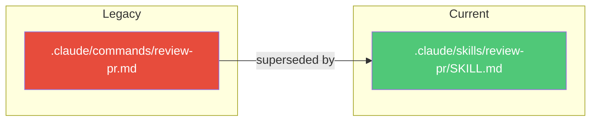

**Commands file:** `.claude/commands/review-pr.md`
```yaml
---
name: review-pr
description: Review a pull request
---

Review PR #$ARGUMENTS focusing on code quality...
```

**Skills vs Commands:**

| Feature | Commands | Skills |
|---------|----------|--------|
| Location | `.claude/commands/` | `.claude/skills/<name>/` |
| Supporting files | No | Yes (templates, scripts, docs) |
| Dynamic injection (`` !`cmd` ``) | No | Yes |
| SubAgent execution (`context: fork`) | No | Yes |
| Lifecycle hooks | No | Yes |
| Tool restrictions (`allowed-tools`) | No | Yes |
| Model override | No | Yes |
| Invocation control | Basic | Full (disable-model, user-invocable) |

**Migration:** Simply move your `.md` file into `.claude/skills/<name>/SKILL.md` and optionally add frontmatter fields.

#### Example: Migrating a command to a skill

Before (command): `.claude/commands/commit.md`
```markdown
---
description: Create a commit with conventional format
---
Create a git commit for staged changes. Use conventional commit format.
```

After (skill): `.claude/skills/commit/SKILL.md`
```yaml
---
name: commit
description: Create a commit with conventional format
disable-model-invocation: true
allowed-tools: Bash, Read
argument-hint: [optional message]
---

Create a git commit for staged changes.
Use conventional commit format: type(scope): description

If $ARGUMENTS is provided, use it as the commit message.
Otherwise, analyze the diff and generate one.

Steps:
1. Run `git diff --cached` to see staged changes
2. Generate a conventional commit message
3. Commit with the message
```

---

### 7. Superpowers (Informal Term)

**"Superpowers" is not an official Claude Code concept.** It's a community/casual term referring to the combined capabilities you unlock by using all the extension points together.

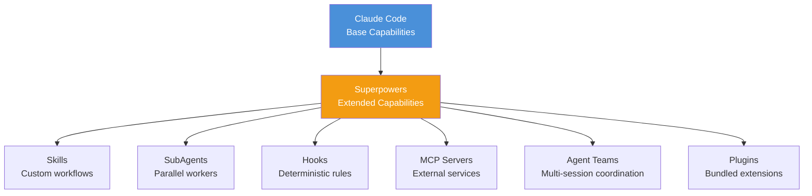

**What people mean by "superpowers":**
- Connecting MCP servers (databases, APIs, Slack, GitHub)
- Creating custom skills for domain-specific workflows
- Setting up hooks for automated code formatting, testing, validation
- Configuring subagents for parallel research
- Using plugins to bundle & share extensions with teams

**Official terminology:** Anthropic's docs use "Extend Claude Code" rather than "superpowers."

---

## Full Comparison Table

| Aspect | Agent | SubAgent | Tool | Skill | Hook | Command |
|--------|-------|----------|------|-------|------|---------|
| **What** | Main session | Isolated worker | Atomic capability | Instruction set | Auto-trigger | Legacy instruction |
| **Analogy** | The developer | An assistant | A wrench, a hammer | A recipe | A safety guard | An old recipe card |
| **Who creates** | Built-in | Built-in + custom | Built-in + MCP | You | You | You |
| **Invoked by** | User (chat) | Agent (Task tool) | Agent (automatic) | User (`/`) or Claude | System (events) | User (`/`) or Claude |
| **Context** | Full conversation | Own isolated context | N/A (stateless) | Loaded into main | Runs externally | Loaded into main |
| **Can edit files** | Yes | Configurable | Tool-dependent | Via Claude, yes | Via shell, yes | Via Claude, yes |
| **Deterministic** | No (LLM) | No (LLM) | **Yes** (code) | No (LLM) | **Yes** (shell) | No (LLM) |
| **Config location** | CLI, settings | `.claude/agents/` | Built-in + MCP | `.claude/skills/` | `.claude/settings.json` | `.claude/commands/` |
| **Can be restricted** | Via permissions | Via `tools` field | Via `allow`/`deny` | Via `allowed-tools` | N/A (they do the restricting) | No |

---

## Real-World Example: How All Concepts Work Together

Here's a scenario that uses every concept:

```
You: /deploy staging

1. [Skill]     "/deploy" skill loads instructions into Claude's context
2. [Agent]     Main agent reads the skill instructions, starts executing steps
3. [Tool]      Agent uses Bash tool to run "npm test"
4. [Hook]      PreToolUse hook fires, validate-bash.sh checks the command -> allows it
5. [Tool]      Bash executes "npm test" -> tests pass
6. [Hook]      PostToolUse hook fires, logs the result to audit.log
7. [SubAgent]  Agent spawns Explore subagent to check deployment configs
8. [Tool]      SubAgent uses Read + Glob to find deploy configs -> returns findings
9. [Agent]     Agent builds the Docker image using Bash tool
10. [Hook]     PreToolUse hook validates the docker command -> allows it
11. [Tool]     Agent uses mcp__aws__deploy (MCP tool) to push to staging
12. [Agent]    Responds: "Deployed to staging. URL: https://staging.example.com"
```

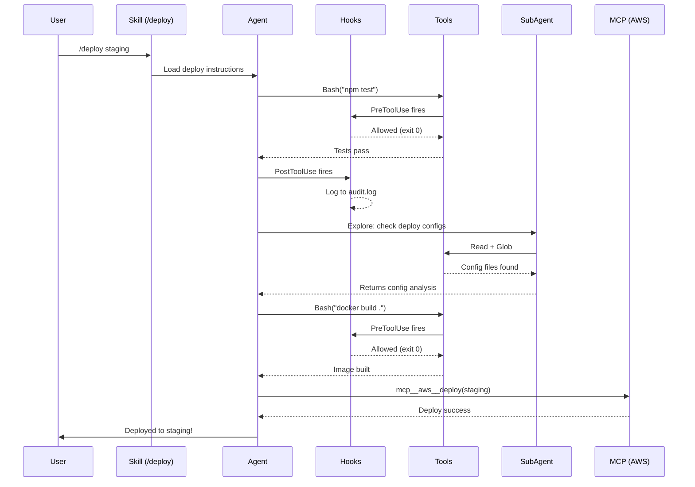

---

## Decision Flowchart: Which One to Use?

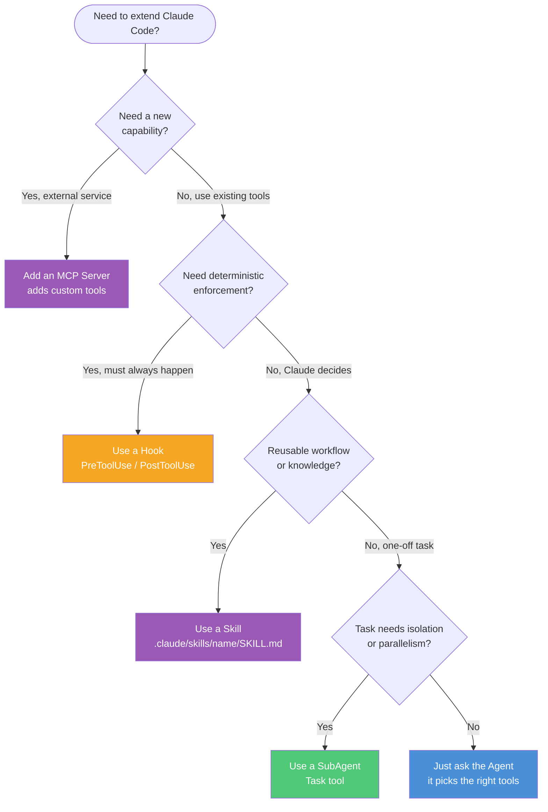

---

## Quick Reference: File Locations

```
~/.claude/
  settings.json              # User-level hooks, permissions, tool rules
  skills/<name>/SKILL.md     # Personal skills (all projects)
  agents/<name>.md           # Personal subagent definitions

<project>/
  CLAUDE.md                  # Project context & instructions
  .mcp.json                  # Project-level MCP server configs
  .claude/
    settings.json            # Project hooks, permissions, tool rules
    settings.local.json      # Local-only settings (gitignored)
    skills/<name>/SKILL.md   # Project skills
    agents/<name>.md         # Project subagent definitions
    commands/<name>.md       # Legacy commands (still work)
```

## Summary

| Concept | One-liner | When to reach for it |
|---------|-----------|---------------------|
| **Agent** | The main Claude Code session | Always -- it's the foundation |
| **SubAgent** | Isolated worker with own context | Parallel tasks, context-heavy research, enforced read-only |
| **Tool** | An atomic action the agent can take | Built-in; extend with MCP for external services |
| **Skill** | Teachable workflow as SKILL.md | Custom `/commands`, domain knowledge, repeatable processes |
| **Hook** | Auto-trigger on lifecycle events | Code formatting, blocking dangerous commands, test automation |
| **Command** | Legacy skill (simpler) | Migrate to Skills; only keep if already working |
| **Superpowers** | All extensions combined | Not a real feature -- just use the above together |

---

*Notes created: 2026-02-23*
*Updated: 2026-02-23 -- Added Tools section with examples, MCP integration, permission system*
