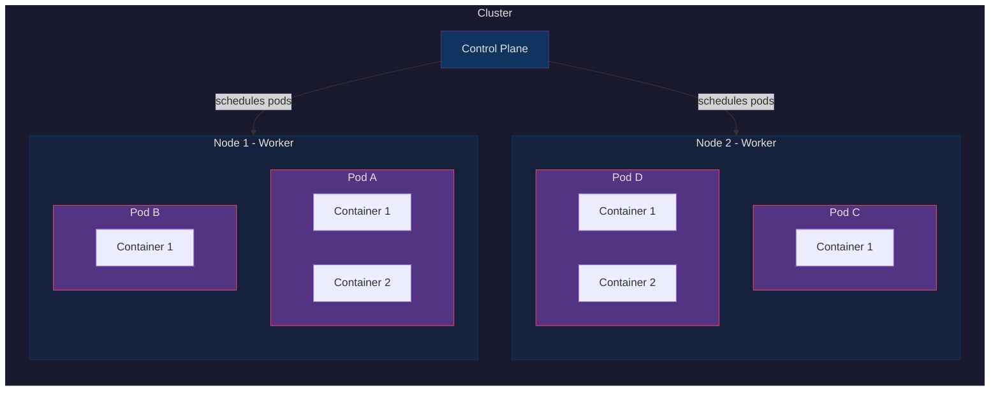
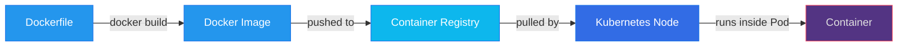
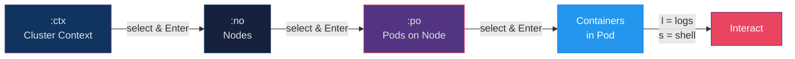
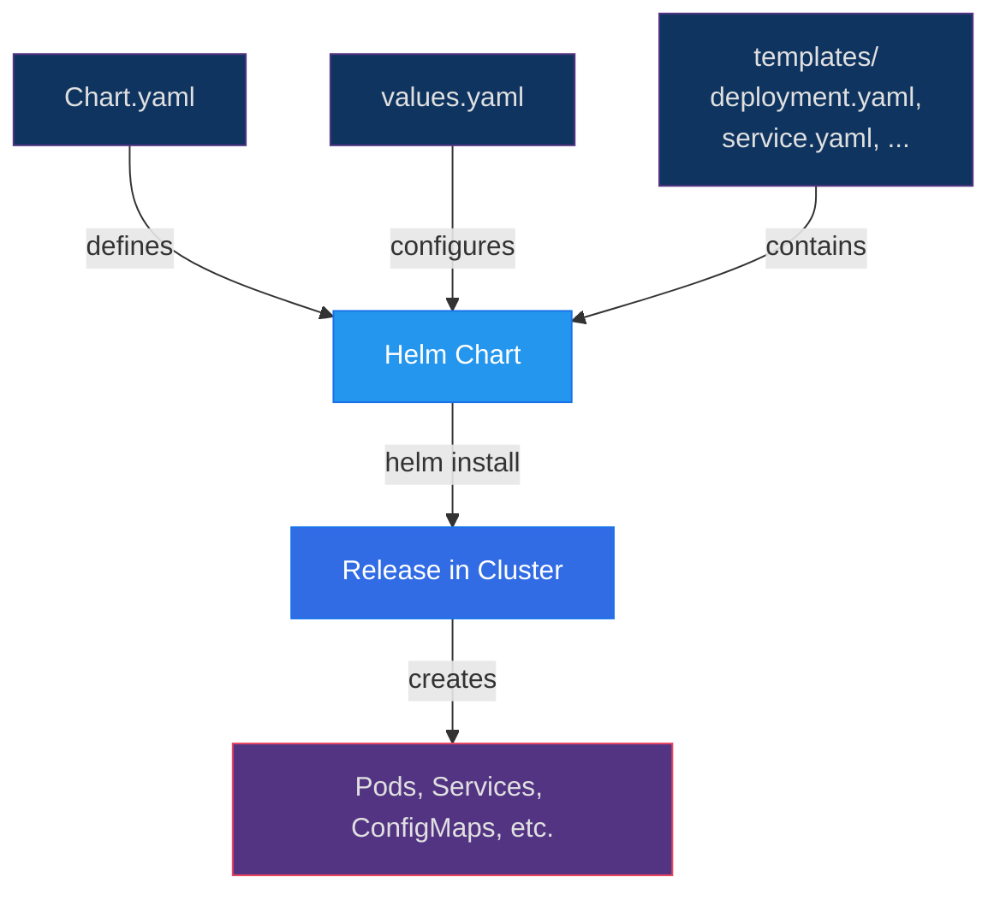
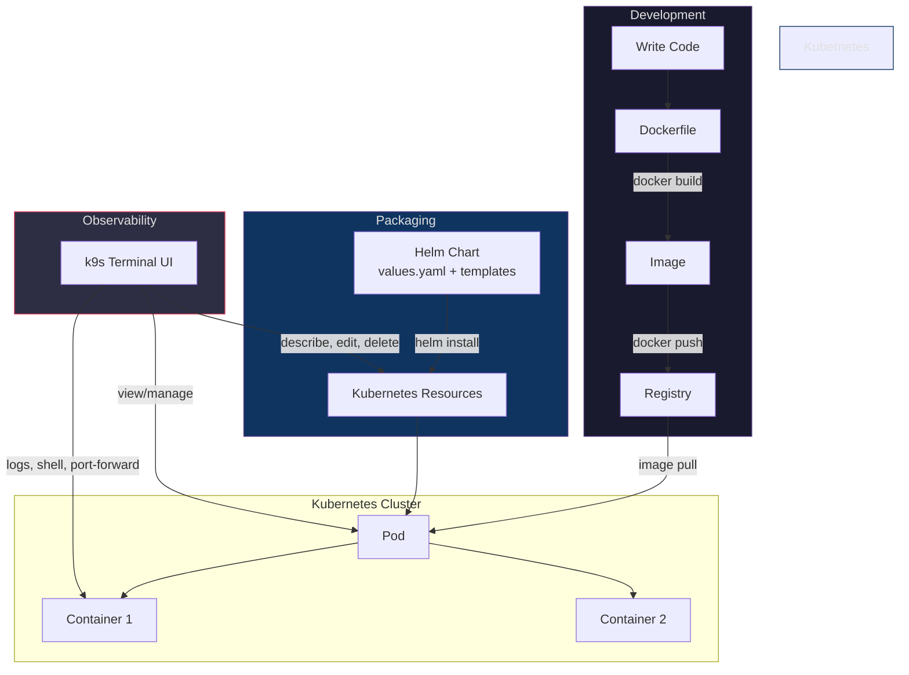

# k9s - Kubernetes CLI Dashboard

> k9s is a terminal-based UI to manage and observe Kubernetes clusters in real time.

## Key Points

- k9s provides a rich terminal UI for interacting with Kubernetes clusters — no browser needed
- Navigates all Kubernetes resources: pods, deployments, services, configmaps, secrets, etc.
- Supports multiple clusters and namespaces with instant switching
- Built-in log tailing, shell exec, port-forwarding, and resource editing
- Uses your existing `~/.kube/config` — no extra auth setup

---

## Kubernetes Architecture

Before diving into k9s, here's how the core Kubernetes pieces fit together:



### Hierarchy Breakdown

| Layer       | What it is                                                                 |
|-------------|----------------------------------------------------------------------------|
| **Cluster** | The entire Kubernetes environment (control plane + worker nodes)           |
| **Node**    | A physical or virtual machine that runs pods                               |
| **Pod**     | The smallest deployable unit — a group of one or more containers           |
| **Container** | A single running Docker/OCI image inside a pod                           |

---

## How Docker Fits In



- **Docker** builds images and can run containers locally
- **Kubernetes** orchestrates those containers across a cluster of machines
- k9s lets you observe and manage the Kubernetes side from your terminal

---

## Installing k9s

```bash
# macOS
brew install derailed/k9s/k9s

# Linux (via Homebrew)
brew install derailed/k9s/k9s

# Linux (binary)
curl -sS https://webinstall.dev/k9s | bash

# Windows (via Scoop)
scoop install k9s

# Verify
k9s version
```

---

## Launching k9s

```bash
# Start with default context from ~/.kube/config
k9s

# Start with a specific context
k9s --context my-cluster

# Start in a specific namespace
k9s -n my-namespace

# Start in read-only mode
k9s --readonly

# Start showing a specific resource
k9s --command pods
```

---

## Drilling Down: Cluster -> Nodes -> Pods -> Containers

This is the most common navigation path in k9s — start from the top and drill into each layer:



### Step-by-step walkthrough

```
1.  k9s                         # launch k9s

--- Cluster / Context ---
2.  :ctx                        # list all cluster contexts
                                # shows: cluster name, auth, default namespace
3.  Select a context -> Enter   # switch into that cluster

--- Nodes ---
4.  :no                         # list all nodes in the cluster
                                # shows: NAME, STATUS, ROLE, VERSION, CPU, MEM
5.  Select a node -> d          # describe node (capacity, allocatable, conditions, pods running on it)
6.  Select a node -> Enter      # drill into pods running on that node

--- Pods ---
7.  :po                         # list all pods (across selected namespace)
                                # shows: NAME, READY, STATUS, RESTARTS, CPU, MEM, AGE, NODE
8.  :po -A                      # list pods across ALL namespaces
9.  Select a pod -> d           # describe pod (events, conditions, container details)
10. Select a pod -> Enter       # drill into containers inside that pod

--- Containers ---
11. Select a container -> l     # view container logs (live tail)
12. Select a container -> s     # shell into the container
13. Select a container -> d     # describe the container (image, ports, mounts, env)
```

### Quick cluster overview commands

| Command              | What you see                                         |
|----------------------|------------------------------------------------------|
| `:ctx`               | All clusters/contexts available                      |
| `:no`                | All nodes — count, status, CPU/MEM usage             |
| `:po`                | All pods in current namespace                        |
| `:po -A`             | All pods across every namespace                      |
| `:deploy`            | All deployments — desired vs ready replicas          |
| `:sts`               | StatefulSets                                         |
| `:ds`                | DaemonSets (pods running on every node)              |
| `:rs`                | ReplicaSets — see scaling history                    |
| `:xray deploy`       | X-Ray view: deployment -> replicaset -> pod -> container tree |
| `:xray no`           | X-Ray view: node -> pod -> container tree            |
| `:pulse`             | Cluster pulse — quick health summary                 |

### Counting resources

In any k9s view, the **top bar** shows the total count of listed resources. For example:
- `:no` view header shows `Nodes (3)` — you have 3 nodes
- `:po` view header shows `Pods (12)` — 12 pods in current namespace
- The `READY` column on pods shows `2/2` meaning 2 of 2 containers are running

---

## Core Navigation & Shortcuts

### Global Keys

| Key              | Action                                      |
|------------------|---------------------------------------------|
| `:`              | Open command prompt (type resource names)    |
| `/`              | Filter / search current view                |
| `?`              | Show help / all shortcuts                   |
| `Ctrl+a`         | Show all available resource aliases          |
| `Esc`            | Back / clear filter                         |
| `q` or `Ctrl+c`  | Quit k9s                                    |

### Resource Navigation

| Key   | Action                                           |
|-------|--------------------------------------------------|
| `Enter` | Select / drill into a resource                 |
| `d`   | Describe the selected resource (like `kubectl describe`) |
| `e`   | Edit resource YAML                               |
| `y`   | View YAML                                        |
| `l`   | View logs for a pod/container                    |
| `s`   | Shell into a container (`exec -it -- sh`)        |
| `f`   | Port-forward                                     |
| `Ctrl+d` | Delete resource                               |
| `Ctrl+k` | Kill a pod (force delete)                     |

### Quick Resource Commands (type after `:`)

| Command        | What it shows            |
|----------------|--------------------------|
| `:pod` or `:po` | Pods                    |
| `:deploy` or `:dp` | Deployments          |
| `:svc`         | Services                 |
| `:ns`          | Namespaces               |
| `:no`          | Nodes                    |
| `:cm`          | ConfigMaps               |
| `:sec`         | Secrets                  |
| `:ing`         | Ingresses                |
| `:rs`          | ReplicaSets              |
| `:ds`          | DaemonSets               |
| `:sts`         | StatefulSets             |
| `:cj`          | CronJobs                 |
| `:pv`          | PersistentVolumes        |
| `:pvc`         | PersistentVolumeClaims   |
| `:ctx`         | Switch cluster context   |
| `:xray deploy` | X-Ray view of deployments|

---

## Common Workflows in k9s

### 1. Debugging a crashing pod

```
1.  k9s                         # launch
2.  :po                         # go to pods view
3.  /my-app                     # filter by name
4.  Select the pod -> Enter     # drill in to see containers
5.  l                           # view logs
6.  Shift+l                     # view previous container logs
7.  s                           # shell into the container
```

### 2. Checking resource usage

```
1.  :no                         # go to nodes view
                                # see CPU/Memory columns
2.  :po                         # go to pods
3.  Shift+s                     # sort by CPU or Memory
```

### 3. Port-forwarding a service locally

```
1.  :po                         # go to pods
2.  Select pod -> f             # port-forward dialog
3.  Enter local:remote ports    # e.g., 8080:80
```

### 4. Switching namespaces and contexts

```
1.  :ns                         # list namespaces, select one
2.  :ctx                        # list contexts, select one
```

---

## Helm Charts Overview



### What is a Helm Chart?

- A **package manager for Kubernetes** — like `apt` for Linux or `brew` for macOS
- A chart is a bundle of YAML templates + default values that define a full application deployment

### Key Helm Commands

```bash
# Add a chart repository
helm repo add bitnami https://charts.bitnami.com/bitnami

# Search for charts
helm search repo nginx

# Install a chart (creates a "release")
helm install my-release bitnami/nginx

# List releases
helm list

# Upgrade a release with new values
helm upgrade my-release bitnami/nginx --set replicaCount=3

# Uninstall
helm uninstall my-release

# View chart values
helm show values bitnami/nginx
```

### Helm Chart Structure

```
my-chart/
  Chart.yaml          # Chart metadata (name, version, description)
  values.yaml         # Default configuration values
  templates/          # Kubernetes manifest templates
    deployment.yaml
    service.yaml
    ingress.yaml
    _helpers.tpl      # Template helpers/partials
  charts/             # Sub-chart dependencies
```

### Viewing Helm Releases in k9s

```
:helm                  # list all Helm releases across namespaces
```

---

## Full Picture: Docker -> Kubernetes -> k9s



---

## Summary

| Tool       | Role                                                    |
|------------|---------------------------------------------------------|
| **Docker** | Build and package container images                      |
| **Kubernetes** | Orchestrate containers across a cluster              |
| **Helm**   | Package and deploy Kubernetes applications              |
| **k9s**    | Real-time terminal UI to observe and manage all of the above |

**Typical flow:** Write code -> Dockerize -> Push image -> Deploy with Helm -> Monitor with k9s

---

*Notes created: 2026-03-28*
